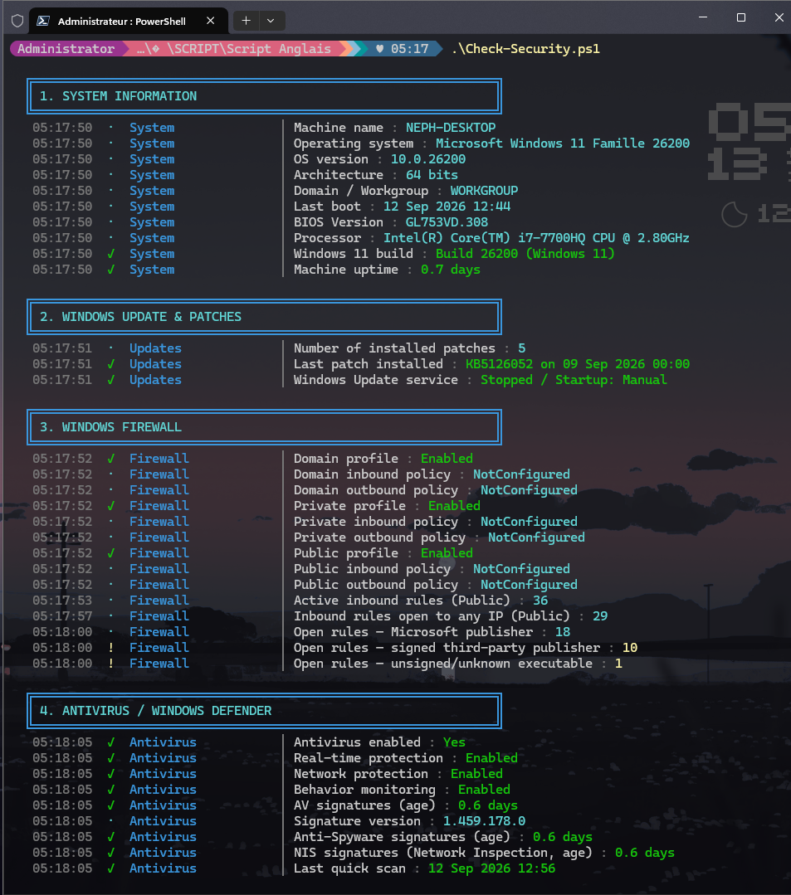
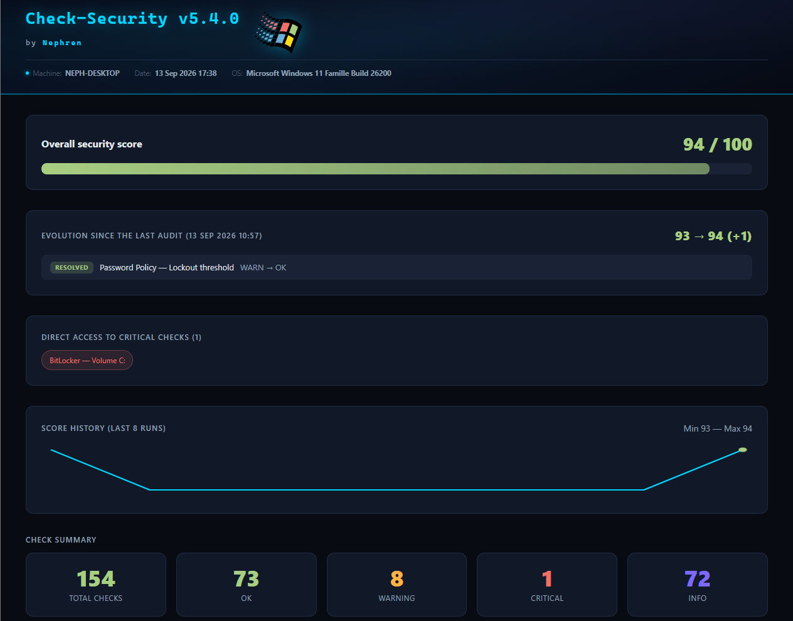
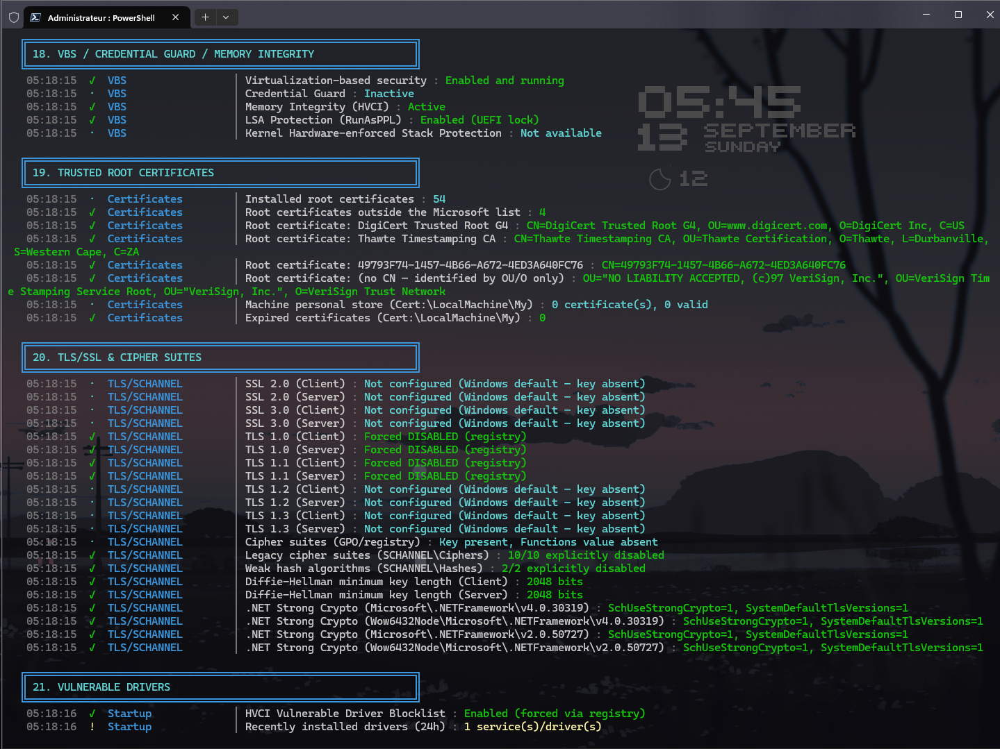
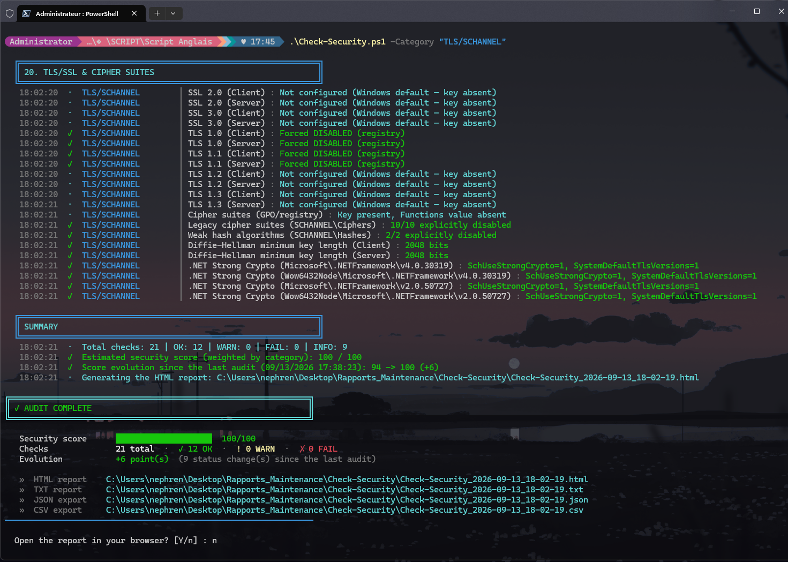

# Check-Security

🇫🇷 [Version française](README_FRENCH.md)

A comprehensive, non-invasive security audit for Windows 11 — 22 sections covering everything from Windows Update status to TLS cipher suites, scored with a category-weighted model, tracked over time, and rendered as a searchable HTML dashboard. Read-only: every check inspects system state, none of them change it.

> Nothing is checked against a name. Trusted root certificates are validated by SHA-1/SHA-256 thumbprint against a manually-verified allowlist — never by their Subject CN, which any malicious self-signed certificate could copy. The score model itself was rebuilt once already after the original version produced a 1/100 score on a genuinely well-hardened machine.

As of **v5.1.0**, the script's own console output, HTML/TXT/JSON/CSV reports, category names, and `-Category` values are all in English. A handful of checks whose *input* is Windows itself — `auditpol`, `vssadmin`, `wbadmin` — parse both the English and French wording those commands can return, so the script keeps working correctly on French-language Windows installs too, not just English ones.

---

## Table of contents

- [Overview](#overview)
- [Screenshots](#screenshots)
- [How the score works](#how-the-score-works)
- [The 22 sections](#the-22-sections)
- [History and regression detection](#history-and-regression-detection)
- [Using the `-Category` filter](#using-the--category-filter)
- [Prerequisites](#prerequisites)
- [First run](#first-run-step-by-step)
- [Command-line parameters](#command-line-parameters)
- [Generated reports](#generated-reports)
- [Multi-machine deployment](#multi-machine-deployment)
- [Troubleshooting](#troubleshooting)

---

## Overview

`Check-Security.ps1` runs a single-pass audit of a Windows 11 machine's security posture: Windows Update status, firewall, Defender, account/password policy, BitLocker, network protocol exposure, scheduled tasks, startup programs, VBS/Credential Guard/HVCI, TLS/cipher configuration, certificate trust store, ransomware resilience (Shadow Copy/VSS), and more — 22 sections in total.

It is entirely **read-only**. No check modifies a setting, stops a service, or writes to the registry outside of its own report/history files — it only reads and reports.

Each finding is recorded with a category, a status (`OK` / `WARN` / `FAIL` / `INFO`), and a plain-language detail. These roll up into a single **weighted score out of 100**, and every run is compared against the previous one to surface what changed.

---

## Screenshots

<p align="center">
  <br>
  
</p>

More in [`screenshots/`](screenshots/) — console output, section-by-section, and the full HTML report.

---

## How the score works

The scoring model went through a documented rewrite (v4.1) after the original "100 − sum of penalties" approach produced a 1/100 score on a machine that actually had HVCI, LSA Protection, Secure Boot, and 18 ASR rules active — penalties stacked without limit as more checks were added, regardless of overall posture.

The current model is a **category-weighted success rate**:

```
For each category C:
    OK / INFO → 1.0   (fully passed)
    WARN      → 0.5   (half credit)
    FAIL      → 0.0   (failed)
    rate(C) = average of the above over every check in that category

Score = Σ(weight(C) × rate(C)) / Σ(weight(C)) × 100
```

This is invariant to how many checks exist in each category, and one `FAIL` in a small category can no longer sink the whole score the way it did under the old model.

**Category weights** (categories not listed default to 1.0):

| Category | Weight | Category | Weight |
|---|---|---|---|
| Antivirus | 1.6 | Certificates | 1.3 |
| BitLocker | 1.6 | Firewall | 1.4 |
| VBS | 1.5 | Network | 1.4 |
| Backup | 1.5 | TLS/SCHANNEL | 1.4 |
| Password Policy | 1.3 | Hardening | 1.4 |
| Accounts | 1.2 | Defender | 1.1 |
| Services | 0.8 | Startup | 0.7 |
| Software | 0.5 | | |

The intent: a `FAIL` on BitLocker or antivirus should hurt more than a `FAIL` on "installed software" — the weights encode that judgment explicitly rather than leaving every check equally important by accident.

---

## The 22 sections

<details>
<summary><strong>1–5 · System, Windows Update, Firewall, Defender, Accounts</strong></summary>

System info + Authenticode signature of the script itself; last patch age (WARN >30 days, FAIL >60); per-profile firewall status and rule classification by publisher (Microsoft-signed → INFO, third-party/unsigned → WARN); Defender real-time protection, last scan age (WARN >7 days, FAIL >30), 30-day threat detection history; local accounts, password policy, and the built-in Administrator (RID-500) account specifically.
</details>

### Password Policy, in more detail

**This checks the local policy Windows would enforce on a *future* password change — not your current password.** `Minimum length required by local policy: 0 characters` (the Windows out-of-box default) doesn't mean your actual password is 0 characters, or that anything about it is weak — it means that if this account's password were changed tomorrow, Windows wouldn't enforce any minimum at all. You can have a strong, long password in place right now despite a permissive policy here; the script says so explicitly in each result's detail text.

| Check | What it reports |
|---|---|
| **Minimum length** | `WARN` below 12 characters — see below for why |
| **Maximum / minimum password age** | Informational — how often Windows would force a change, and the minimum delay before changing again |
| **Lockout threshold** | `WARN` if disabled (`0` attempts) — no automatic lockout after repeated failed sign-ins |
| **Lockout duration** | `WARN` if configured but under 5 minutes — long enough to blunt rapid brute-force bursts |

**Why 12 characters, specifically?** That's current mainstream guidance (NIST SP 800-63B, CISA, ANSSI) — the older "8 characters" standard dates from when offline cracking was far slower. On modern GPU hardware, an 8-character NTLM hash — complex or not — can fall to brute force in hours; every additional character multiplies the search space by roughly 95 (the printable ASCII range). 12 is roughly the point where even a sustained offline attack stops being economically worth it, which is why the general trend (NIST included) has shifted from "mandatory complexity" to "length first."

If you want to raise it: `net accounts /minpwlen:12` (adjust the number to taste). This is a policy setting, not a fix for anything actively broken — treat a `WARN` here as a recommendation, not an error.

<details>
<summary><strong>6–10 · UAC, BitLocker, Network, Services, Audit logs</strong></summary>

UAC level; BitLocker (system drive `C:` → FAIL if off, other volumes → WARN); listening ports classified by exposure (RDP on `0.0.0.0` → FAIL, WinRM → strong WARN, RPC 135/SMB 445 on system interfaces → INFO since that's normal Windows behavior), established TCP connections to public IPs enriched with process name, IPv6 firewall exposure, active network profile per interface; non-system auto-start services with suspicious paths; audit policy configuration and recent security events (4648 explicit-credential logons, 4720/4726 account creation/deletion).
</details>

<details>
<summary><strong>11–15 · Scheduled tasks, Secure Boot/TPM, PowerShell, Software, Startup</strong></summary>

Suspicious scheduled tasks; Secure Boot and TPM status; PowerShell execution policy, Script Block Logging/Transcription (downgraded to INFO on a personal machine — these are enterprise forensic tools that add noise without a SOC watching the logs), Smart App Control (CPU-compatibility aware: "unavailable" on unsupported hardware is INFO, not a warning); installed software inventory; startup programs from both registry autoruns and Startup folders, IFEO hijacking and `AppInit_DLLs` persistence checks.
</details>

<details>
<summary><strong>16–19 · Defender exclusions, Windows Hello, VBS, Certificates</strong></summary>

Defender path/extension/process exclusions (flagged if overly broad); Windows Hello PIN/biometric enrollment; VBS, Credential Guard, Memory Integrity (HVCI), and LSA Protection (RunAsPPL); trusted root certificates validated by **thumbprint against a manually-verified allowlist** (see below) and expired certificates in the personal store.
</details>

<details>
<summary><strong>20–22 · TLS/cipher suites, Vulnerable drivers, Shadow Copy/VSS</strong></summary>

**TLS/SCHANNEL** — five independent checks, detailed just below the table: protocol state (TLS 1.0/1.1 disabled, TLS 1.2/1.3 enabled), a GPO-forced cipher-suite-order policy if one exists, individual legacy ciphers (RC4/DES/RC2/3DES/NULL) disabled at the registry level, weak hash algorithms (MD5/SHA-1), Diffie-Hellman minimum key length, and .NET Framework Strong Crypto on every .NET install actually present. **Drivers** against the Microsoft HVCI vulnerable-driver blocklist and recently-installed drivers. **Shadow Copy/VSS** — Volume Shadow Copy service and existing restore points (ransomware-recovery relevant).
</details>

### TLS/SCHANNEL, in more detail

SCHANNEL is the low-level Windows component every TLS/SSL connection on the machine goes through — RDP, LDAPS, IIS, most .NET applications, and plenty of third-party software that doesn't bring its own TLS stack. Section 20 reads its state across five independent registry surfaces:

| Check | What it means if it's weak |
|---|---|
| **Protocols** (TLS 1.0/1.1/1.2/1.3) | TLS 1.0/1.1 are deprecated and vulnerable to **POODLE**/**BEAST** — they should be disabled, client and server side |
| **Cipher-suite order (GPO)** | A domain/local Group Policy can force a specific suite list; if one exists, it shouldn't contain RC4, 3DES, DES, NULL, or EXPORT |
| **Individual legacy ciphers** | RC4, DES, RC2, Triple DES 168, and NULL can each be disabled independently at the registry level — the mechanism actually used outside a domain, separate from the GPO check above |
| **Weak hash algorithms** | MD5 and SHA-1 are still accepted by SCHANNEL unless explicitly disabled |
| **Diffie-Hellman min key length** | Below 2048 bits, a connection is vulnerable to a **Logjam**-style downgrade |
| **.NET Framework Strong Crypto** | Without it, a .NET application can bypass every setting above and negotiate TLS through its own legacy stack |

<p align="center"></p>

POODLE, BEAST, and Logjam aren't theoretical — they're named, practical attacks against exactly the defaults Windows still ships unless someone explicitly turns them off. A machine that's never been touched will show most of this section as `WARN` or `INFO` ("Windows default") — that's expected, not a bug in the audit.

**Check-Security only reads this state — it never writes to the registry.** If Section 20 comes back with `WARN`s, that's a report, not a fix. To actually harden TLS/SCHANNEL on the machine, run the companion script **[Harden-TLS](https://github.com/NephVx2/Harden-TLS)** (same author, same suite), then re-run Check-Security afterward to confirm the change took effect.

**Certificate trust validation, specifically:** the allowlist of "known-good" root certificates is indexed by **SHA-1/SHA-256 thumbprint**, not by Subject CN — a deliberate design choice explained directly in the script: a certificate's display name is just a string, and any self-signed certificate could set its CN to `"DigiCert Trusted Root G4"`. Matching by name would be trivially bypassable; matching by thumbprint means an entry can only be legitimate if someone has actually verified that exact certificate.

---

## History and regression detection

Every run writes its score to a rolling history file (last 20 runs) and compares against the immediately preceding run:

- **Per-check deltas** — anything that changed status (e.g. `OK → WARN`) since last time is called out specifically, not just the aggregate score.
- **Regression alert** — if the score drops by more than `$ScoreRegressionThreshold` (default: **5 points**) since the last run, a red banner appears in both the console and the HTML report. A 1–2 point wobble is normal noise; a 5+ point drop means something real changed.
- **Trend sparkline** — a small SVG chart of the last 20 scores rendered directly in the HTML report.
- **Executive summary** — a "Critical points" block at the very top of the HTML report lists every current `FAIL` (and then `WARN`, up to 10 total) before you scroll into the full 22-section detail.

---

## Using the `-Category` filter

`-Category` re-runs only the sections that match, instead of the full ~3-minute audit — handy right after a targeted fix (enabled BitLocker, ran Harden-TLS, disabled a service) when you just want to confirm that one thing changed.

```powershell
.\Check-Security.ps1 -Category "BitLocker"
.\Check-Security.ps1 -Category "BitLocker","TLS/SCHANNEL"
```

It's a `[string[]]`, so pass one or more values, comma-separated. A section runs if *any* of its own categories partially matches *any* value you pass (`-like` on both sides), so `-Category "TLS"` also matches the `TLS/SCHANNEL` category. The accepted values are the same ones in the score-by-category table above, plus a few checks-only categories that don't carry a custom weight (`System`, `Updates`, `UAC`, `Audit`, `Scheduled Tasks`, `UEFI Security`, `Windows Hello`, `Defender`) — see the script's own help (`Get-Help .\Check-Security.ps1 -Full`) for the exact list under `-Category`.

Two pieces of state ($OS/$CS/$BIOS/$CPU, and the Windows Hello detection) are shared between sections that don't otherwise run together, so they're always computed regardless of which `-Category` you pass — filtering never leaves the HTML report's header or the Windows Hello check with missing data.

<p align="center"></p>

---

## Prerequisites

- Windows 11 (the script checks the build number and reports `FAIL` if run on an older OS — it still runs, but flags itself as out of its intended scope).
- PowerShell 5.1 (built into Windows) or PowerShell 7+.
- Administrator rights (`#Requires -RunAsAdministrator` — the script will refuse to start without them; there is no self-elevation logic, unlike some other scripts in this suite).
- If the script is digitally signed (recommended in environments using `-ExecutionPolicy AllSigned`/`RemoteSigned`): the signing certificate must be trusted on the target machine.

---

## First run (step by step)

1. Copy `Check-Security.ps1` to the target machine.

2. Open PowerShell **as Administrator** — the script requires elevation up front and does not self-elevate.

   Then go to the folder that contains the script (adjust the path; keep the quotes if it contains spaces):

   ```powershell
   cd "$HOME\Downloads"
   ```

3. **Unblock the script** if you downloaded it from the Internet. Windows flags downloaded files, and PowerShell's execution policy (`RemoteSigned`, for example) refuses to run a flagged script. In that same Administrator window, from the script's folder:

   ```powershell
   Unblock-File .\Check-Security.ps1
   ```

   If PowerShell says instead that running scripts is disabled on this system (the Windows default policy is `Restricted`), allow scripts for the current account first (the change applies to this account only, not to the whole machine):

   ```powershell
   Set-ExecutionPolicy -Scope CurrentUser -ExecutionPolicy RemoteSigned
   ```

   Still blocked? See the [step-by-step guide](https://github.com/NephVx2/Script-blocked-Look-at-this).

   Runs 44 internal assertions (HTML-escaping helper, status-badge rendering, category weights table, the `ShouldRunSection` helper itself, score-regression threshold sanity, and more). Exit code `0` = all passed, `1` = at least one failure.

4. Run the full audit:

   ```powershell
   .\Check-Security.ps1
   ```

   Takes roughly a few minutes depending on the machine (event log queries and certificate enumeration are usually the slowest steps). Watch the console for a live `[OK]`/`[WARN]`/`[FAIL]`/`[INFO]` stream as each section completes.

5. When it finishes, the console prints a final banner with the weighted score, followed by up to 5 `FAIL` and 5 `WARN` findings for an immediate read without opening the HTML report.

6. Open the generated HTML report (the script offers to do this automatically unless `-Silent` is used) — start with the "Critical points" block at the top, then use the search box to jump to any specific check.

7. On the **second and subsequent runs**, the console and HTML report will additionally show what changed since last time, and a regression banner if the score dropped by more than 5 points.

8. If a specific `FAIL` needs a source-verified answer (e.g. "is this root certificate legitimate?"), don't just trust the report — cross-check the certificate thumbprint against Microsoft's or the vendor's own published list before adding it to the allowlist in the script.

---

## Command-line parameters

| Parameter | Description |
|---|---|
| `-Silent` | Suppresses console output, the "open in browser" prompt, and the final ENTER pause — for scheduled-task use. Reports (HTML/TXT/JSON/CSV) are still generated normally. |
| `-SelfTest` | Runs the 48-assertion internal test suite and exits. No admin rights required beyond the script-wide `#Requires`, no reports generated, nothing modified. Exit code `0`/`1`. |
| `-Category <name(s)>` | Runs only the matching sections instead of the full audit — see [Using the -Category filter](#using-the--category-filter) above. |

**Examples:**

```powershell
.\Check-Security.ps1 -SelfTest
.\Check-Security.ps1
.\Check-Security.ps1 -Silent
```

---

## Generated reports

Every real run (not `-SelfTest`) writes to:

```
%USERPROFILE%\Desktop\Rapports_Maintenance\Check-Security\
```

| File | Content |
|---|---|
| `Check-Security_<timestamp>.html` | Full dashboard: executive summary ("Critical points"), weighted score, per-category breakdown table, trend sparkline, regression banner if applicable, full searchable/filterable 22-section detail with anchors |
| `Check-Security_<timestamp>.txt` | Plain-text equivalent of the full findings |
| `Check-Security_<timestamp>.json` | Full machine-readable export of every finding |
| `Check-Security_<timestamp>.csv` | Tabular export of every finding |
| `_last_audit_baseline.json` | Snapshot of the last run only, overwritten every run — used to compute per-check deltas |
| `_score_history.json` | Rolling history of the last 20 (date, score) pairs — used for the trend sparkline |

---

## Multi-machine deployment

1. **Distribute** the `.ps1` file to each target machine.

2. **Trust the signing certificate** if a strict execution policy is enforced (`-ExecutionPolicy AllSigned`/`RemoteSigned`).

3. **Run `-SelfTest` first** on each machine to confirm the script itself is intact before relying on a full audit.

4. **Schedule via Windows Task Scheduler** with `-Silent`, running as Administrator (required — the script has no self-elevation, so the task itself must already run elevated):

   | Field | Value |
   |---|---|
   | Program/script | `pwsh.exe` (or `powershell.exe`) |
   | Arguments | `-NoProfile -ExecutionPolicy Bypass -File "C:\Scripts\Security\Check-Security.ps1" -Silent` |
   | Run with highest privileges | Yes |

5. **Review the "Critical points" summary first** on each machine's HTML report rather than reading the full 22 sections every time — that's exactly what it's there for.

6. Reports, baseline, and history are **local to each machine** — no data is centralized automatically. For a fleet-wide view, a separate collection step (network share, log shipping) would need to be added on top of this script.

7. **Certificate allowlist is machine-specific by design.** The `$TrustedRootThumbprintAllowlist` in the script was populated by manually verifying specific certificates found on one particular machine (NEPH-DESKTOP). Deploying this script as-is to another machine means its own legitimate-but-different root certificates will show up as unrecognized — that's the script working correctly, not a bug. Review and extend the allowlist per machine (or per known fleet image) rather than assuming one allowlist fits every deployment target.

---

## Troubleshooting

<details>
<summary><strong>The script won't start at all</strong></summary>

It requires Administrator rights up front (`#Requires -RunAsAdministrator`) and does not self-elevate — right-click PowerShell and choose "Run as administrator" before launching it, or launch from an already-elevated terminal.
</details>

<details>
<summary><strong>A brand-new root certificate shows up as unrecognized</strong></summary>

Expected on any machine other than the one the allowlist was built for (see [Multi-machine deployment](#multi-machine-deployment)). Verify the certificate's thumbprint independently (Microsoft's published root list, the vendor's own documentation, or `certutil`) before adding it to `$TrustedRootThumbprintAllowlist` — never add a thumbprint just because the report flagged it, that defeats the point of the allowlist.
</details>

<details>
<summary><strong>The score dropped and I don't know why</strong></summary>

Check the HTML report's regression banner (only shown if the drop exceeds `$ScoreRegressionThreshold`, 5 points by default) and the per-check delta list — both are computed automatically by comparing against `_last_audit_baseline.json`. A 1–2 point wobble between runs can be normal noise in a category with only a couple of checks.
</details>

<details>
<summary><strong>-SelfTest reports a FAIL</strong></summary>

Read the assertion name directly — it points at a specific broken helper function (HTML escaping, status badge rendering, a missing category weight, etc.), not at the machine's actual security posture. This is a script self-check, unrelated to what a full audit would report.
</details>

---

<sub>Check-Security — 22 sections, read-only, category-weighted scoring, thumbprint-based certificate trust, 44-assertion self-test.</sub>
